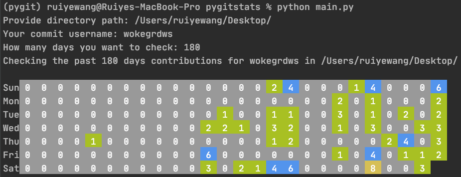

# Pygitstats
Visulize your local git contributions in terminal using Python.
Inspired by [Visualize your local Git contributions with Go](https://flaviocopes.com/go-git-contributions/)

## set up
```
conda install gitpython
```

## usage
```
python main.py
```
- directory path. All git commits under this directory and its sub-directories will be found.
- username.
- how many days?

